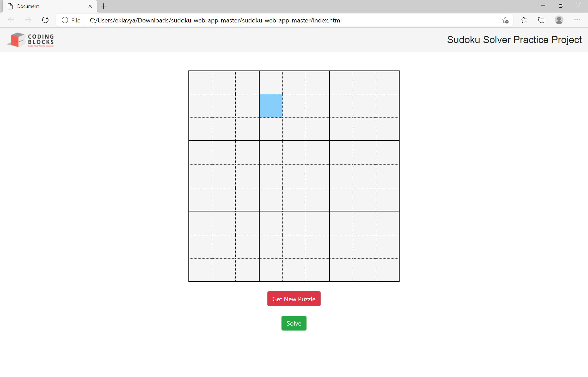
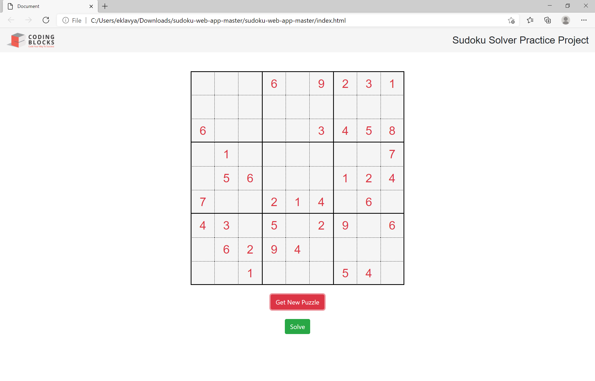

# Sudoku Web App

A simple **Sudoku puzzle generator and solver** built with HTML, CSS, and JavaScript.  
It fetches puzzles from public Sudoku APIs and also includes a backtracking solver to automatically solve puzzles.

---

## 📸 App Preview

### Initial Preview

  

### Generate Puzzle

  

### Solve Puzzle

  

---

## 🚀 Features

- Clean **9x9 Sudoku grid UI**
- **Get New Puzzle** button (fetches puzzle from API or fallback sample)
- **Solve** button that uses backtracking algorithm
- Highlights the given numbers in **red** and solved numbers in **green**
- Fully responsive layout

---
